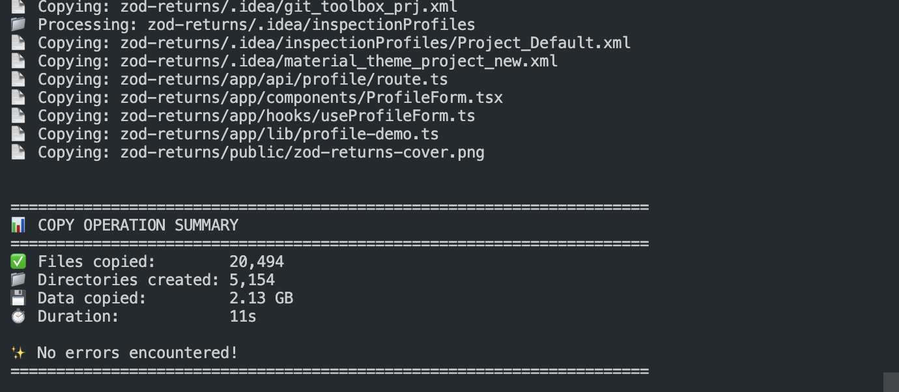

# Project Copy Script



A Node.js-based utility script for efficiently copying Node.js projects while automatically excluding node_modules, build artifacts, cache directories, and other unnecessary files.

## Overview

This script is designed specifically for **Node.js-based projects** and helps you create clean backups or copies of your projects by intelligently skipping:

- **Build outputs**: `dist`, `build`, `out`, `.next`, `.nuxt`, `.svelte-kit`, etc.
- **Cache directories**: `.cache`, `.turbo`, `.vite`, `.parcel-cache`, `.eslintcache`, etc.
- **Dependencies**: `node_modules`
- **Test coverage**: `coverage`, `.nyc_output`
- **Temporary files**: `.tmp`, `tmp`, `temp`

## Requirements

- **Node.js** version 14.0.0 or higher
- No additional dependencies required (uses only Node.js built-in modules)

## Features

- 🚀 Fast and efficient file copying
- 📊 Detailed progress tracking and statistics
- 🎯 Smart filtering for Node.js project artifacts
- ✅ Error handling and reporting
- ⏱️ Performance metrics (files copied, data size, duration)

## How to Use

### Basic Usage

1. Make sure you have Node.js 14+ installed:
   ```bash
   node --version
   ```

2. Run the script:
   ```bash
   node copy-projects.js
   ```

3. Follow the prompts:
   - **Source directory**: Enter the path to the Node.js project you want to copy (or press Enter to use the current directory)
   - **Destination directory**: Enter the path where you want to copy the project

4. Wait for the operation to complete. The script will display:
   - Real-time progress updates
   - A comprehensive summary with statistics

### Example

```bash
$ node copy-projects.js
🚀 Project Copy Script
======================================================================
Enter the source directory path (press Enter to use current directory: /Users/username/projects): 
Enter the output directory path: /Users/username/backups/my-project-backup

📦 Starting copy operation...
📄 Copying: package.json
📁 Processing: src/
...

📊 COPY OPERATION SUMMARY
======================================================================
✅ Files copied:        20,494
📁 Directories created: 5,154
💾 Data copied:         2.13 GB
⏱️  Duration:            11s
✨ No errors encountered!
```

### Tips

- The script automatically creates the destination directory if it doesn't exist
- You can interrupt the operation with `Ctrl+C` - it will show a summary of what was copied before exiting
- The script preserves the directory structure while excluding unnecessary files

## Example Output

The script provides real-time progress updates and a comprehensive summary showing:
- Total files copied
- Directories created
- Total data copied (in human-readable format)
- Operation duration
- Any errors encountered (if any)

Perfect for backing up your Node.js projects without the bloat of build artifacts and dependencies!

